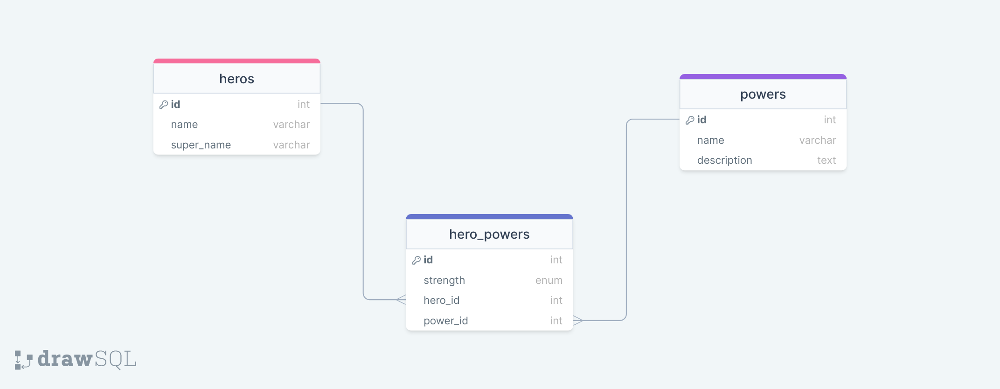

# Superheroes-Challenge
A mini Rails application that implements associations.
## Description
This is a simple Rails application that I developed to sharpen my skills on developing Rails applications, Active Record Associations and Rails API development.

This is an API for tracking superheroes and their powers. I am working with three models: `Hero`, `Power` and `HeroPower`. Their relationships are as follows:

- A `Hero` has many `Power`s through `HeroPower`
- A `Power` has many `Heroe`s through `HeroPower`
- A `HeroPower` belongs to a `Hero` and belongs to a `Power`

The ER Diagram below illustrates the above relationships:

## Getting Started
### Setup Requirements
- Operating System: Any UNIX based Operating System should suffice.
- Ruby installed on your system(version 2.7.3 and above).
- Rails (version 7 and above)
- Code editor/IDE to view and/or contribute to the project(preferably VScode or RubyMine IDE).
- Git installed on your system.

### Setup
To clone this repository in your PC, run:

        git clone git@github.com:Samueelx/superheroes-challenge.git

`cd` into the project directory and run this command to download the necessary gems/dependencies:

        bundle install

## Running the program
### Migrate the database
For this application to run, you first need to set up the database schema. To do so, you need to run a migration. Use this command to run the migration(at the root of the project direcory):

        rails db:migrate

Then, populate the database tables with sample data using the following command (at the root of the project direcory):

        rails db:seed

### Running the server
To run the server, execute the command below in your terminal:

        rails s

As the server is running, you can test out the endpoints from [postman](https://www.postman.com/)

## Routes
1. `GET /heroes` - List of all heroes as JSON:

        [  

            { "id": 1, "name": "Kamala Khan", "super_name": "Ms. Marvel" },  

            { "id": 2, "name": "Doreen Green", "super_name": "Squirrel Girl" },  

            { "id": 3, "name": "Gwen Stacy", "super_name": "Spider-Gwen" }

        ]

2. `GET /heroes/:id` - Get a specific hero as JSON:

        {
            "id": 1,
            "name": "Kamala Khan",
            "super_name": "Ms. Marvel",
            "powers": [
                {
                    "id": 1,
                    "name": "super strength",
                    "description": "gives the wielder super-human strengths"
                 },
                {
                    "id": 2,
                    "name": "flight",
                    "description": "gives the wielder the ability to fly through the skies at supersonic speed"
                }
            ]
        }

3. `Get /powers` - Get a list of all powers as JSON:

        [
            {
                "id": 1,
                "name": "super strength",
                "description": "gives the wielder super-human strengths"
            },
            {
                "id": 1,
                "name": "flight",
                "description": "gives the wielder the ability to fly through the skies at supersonic speed"
            }
        ]

4. `GET /powers/:id` - Get info about a particular power as JSON:

        {
            "id": 1,
            "name": "super strength",
            "description": "gives the wielder super-human strengths"
        }

5. `PATCH /powers/:id` - This route should update an existing `Power` and and return JSON data on successful update:

        {
            "id": 1,
            "name": "super strength",
            "description": "Updated description"
        }

6. `POST /hero_powers` - This route should create a new `HeroPower` that is associated with an
existing `Power` and `Hero`. It should accept an object with the following
properties in the body of the request:

        {
            "strength": "Average",
            "power_id": 1,
            "hero_id": 3
        }

If the `HeroPower` is created successfully, send back a response with the data
related to the `Hero`:

        {
            "id": 1,
            "name": "Kamala Khan",
            "super_name": "Ms. Marvel",
            "powers": [
                {
                    "id": 1,
                    "name": "super strength",
                    "description": "gives the wielder super-human strengths"
                },
            ]
        }

## Authors
[Samuel Gitimu](https://github.com/Samueelx)

## License
This project is under the MIT license.